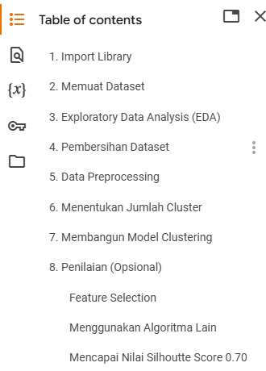
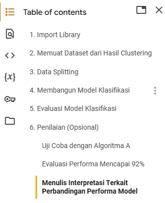

# Agents

Anda adalah seorang ahli dalam bidang Data Science. Pada proyek ini, Anda akan membangun model machine learning dengan pendekatan supervised dan unsupervised learning. Anda dapat memilih dari beberapa dataset tanpa label yang kami sediakan atau mencarinya sendiri sesuai dengan preferensi masing-masing.

Langkah pertama adalah menerapkan teknik unsupervised learning, khususnya clustering, untuk menghasilkan label atau kelas pada dataset tersebut. Setelah mendapatkan label atau kelas dari proses clustering, Anda akan menggabungkan informasi ini dengan dataset asli.

Dengan dataset yang telah dilengkapi dengan label atau kelas, Anda akan menerapkan metode supervised learning, yaitu klasifikasi, untuk mengembangkan model yang mampu memprediksi kelas berdasarkan fitur yang ada. Proyek ini dirancang untuk menilai kemampuan Anda dalam mengintegrasikan kedua metode tersebut dan memecahkan masalah yang relevan dengan teknik machine learning yang telah dipelajari.

Panduan Dataset untuk Submission Kelas
Untuk memastikan pengerjaan proyek clustering berjalan terstruktur dan sesuai standar evaluasi, peserta diwajibkan mengikuti template yang telah disediakan. Setiap langkah harus dilakukan secara sistematis dan mematuhi instruksi yang diberikan dalam template proyek. Berikut ini hal-hal yang perlu diperhatikan sebelum memulai pengerjaan projek:

- Eksekusi Notebook Disediakan pada folder `Codes/`.
- Dataset yang digunakan terdapat di file `Dataset/bank-transaction-dataset.csv`.
- Mengikuti template dalam notebook proyek sesuai struktur yang diberikan.
- Kriteria yang dapat diterima untuk pengerjaan proyek ini dapat dilihat di file `Acceptance-Criteria.md` di bagian `Criteria`. Adapun saran alur pengerjaan proyek ini dapat dilihat pada bagian `Suggested Flow` pada file `Acceptance-Criteria.md`.

Fig 1. Struktur Markdown Clustering

Fig 2. Struktur Markdown Klasifikasi

Untuk meningkatkan kualitas dokumentasi dan memberikan pemahaman yang lebih baik terhadap proyek yang dikerjakan, peserta disarankan menambahkan penjelasan rinci pada setiap analisis dengan format berikut:

- Metode yang digunakan → Teknik atau algoritma yang diterapkan dalam tahap tersebut.
- Alasan penggunaan → Mengapa metode tersebut dipilih dan bagaimana relevansinya dengan proyek.
- Hasil yang didapat → Interpretasi hasil setelah metode diterapkan.
