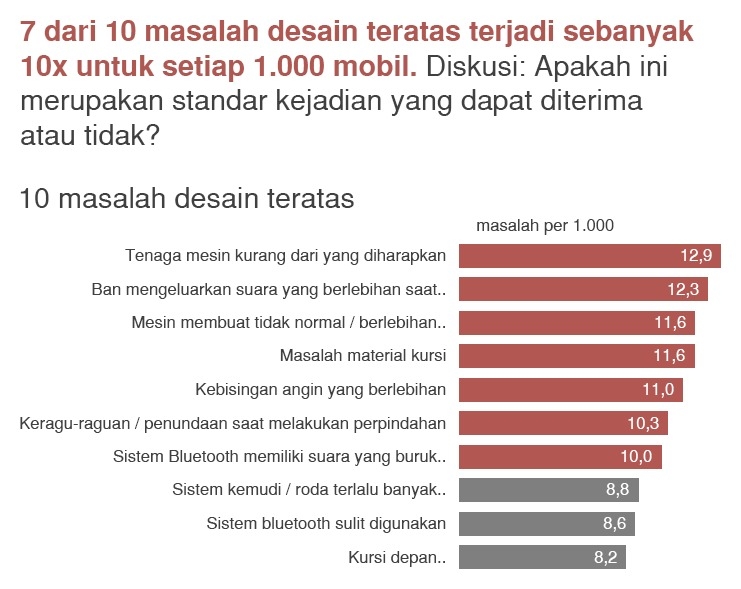
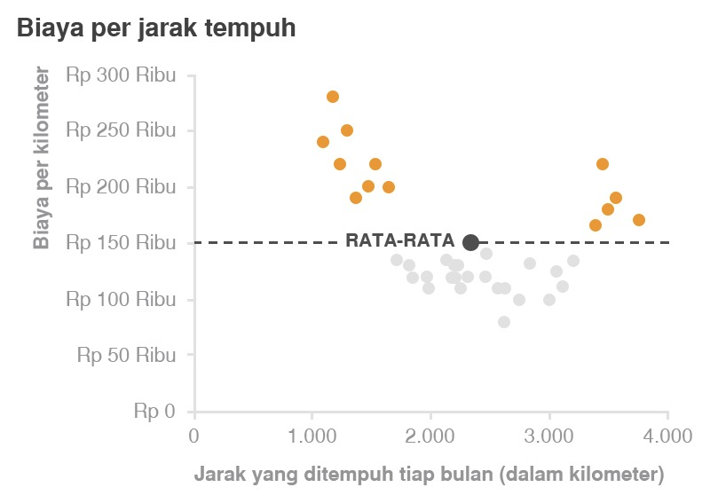
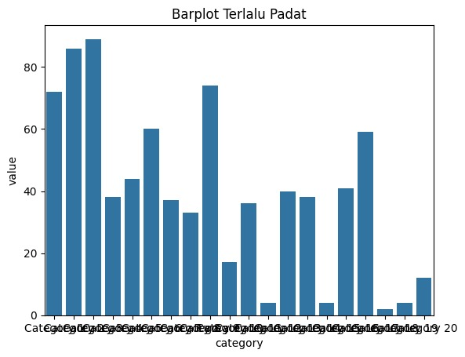
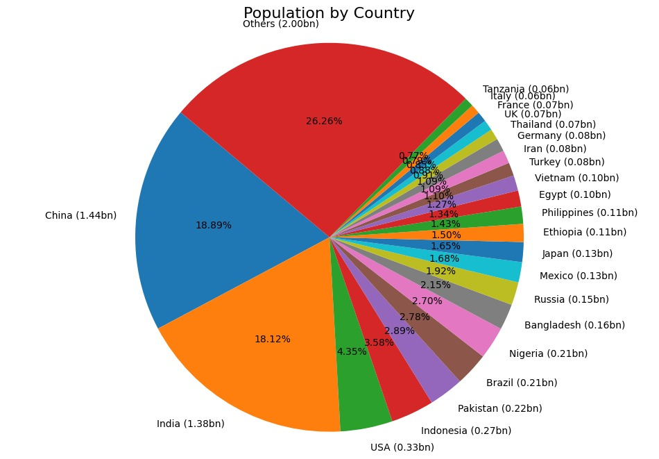
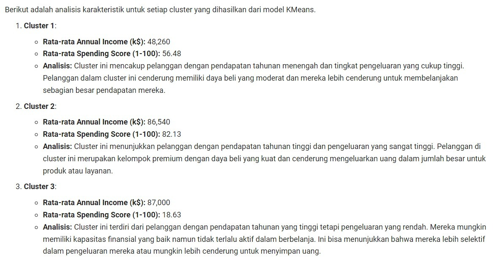
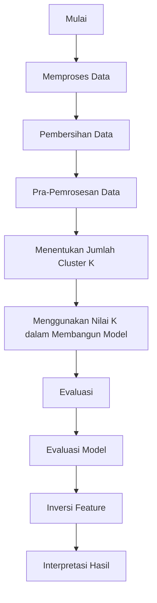
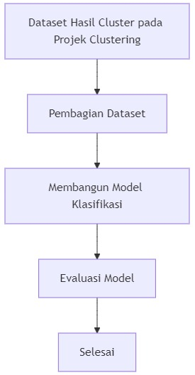

# Criteria

Submission ini mencakup dua tahap utama, yaitu Clustering dan Klasifikasi, dengan kriteria serta urutan kerja sebagai berikut.

Disarankan menggunakan scikit-learn versi 1.7.0 agar tidak terjadi conflict ketika pemeriksaan.

## Kriteria 1: Memuat Dataset dan Melakukan Exploratory Data Analysis (EDA)

- Menampilkan dataset menggunakan function head().
- Menampilkan informasi dataset dengan info().
- Menampilkan statistik deskriptif dataset dengan menjalankan describe() untuk mendapatkan ringkasan data.

### Reject (0 pts)

- Tidak menampilkan dataset menggunakan function head().
- Tidak menampilkan informasi dataset dengan info().
- Tidak menampilkan statistik deskriptif dataset dengan menjalankan describe() untuk mendapatkan ringkasan data.
- Cell code tidak memiliki output pada kode yang seharusnya menampilkan output atau mengalami error.

### Basic (2 pts)

- Menampilkan dataset menggunakan function head().
- Menampilkan informasi dataset dengan info().
- Menampilkan statistik deskriptif dataset dengan menjalankan describe() untuk mendapatkan ringkasan data.

### Skilled (3 pts)

- Semua ketentuan pada Basic terpenuhi.
- Menampilkan matriks korelasi.
- Menampilkan histogram untuk semua kolom dalam dataset, baik itu bertipe numerik maupun kategorikal.

### Advanced (4 pts)

- Semua ketentuan pada Skilled terpenuhi.
- Visualisasi yang dilakukan tidak memiliki label yang overlap.
- Berikut contoh visualisasi yang perlu Anda perhatikan.
  

Fig 3. Visualisasi yang Baik dan Informatif 1

Fig 4. Visualisasi yang Baik dan Informatif 2

Fig 5. Visualisasi yang Tidak Baik dimana Label saling tumpang tindih

Fig 6. Visualisasi yang Kurang Informatif

## Kriteria 2: Pembersihan dan Pra Pemrosesan Data

- Mengecek dataset menggunakan isnull().sum() dan duplicated().sum().
- Melakukan feature scaling menggunakan MinMaxScaler() atau StandardScalar() untuk fitur numerik.
- Melakukan feature encoding menggunakan LabelEncoder() untuk fitur kategorikal.
- Melakukan drop pada kolom yang memiliki keterangan ID seperti TransactionID, AccountID, DeviceID, IPAddress, MerchantID

### Reject (0 pts)

- Tidak mengecek dataset menggunakan isnull().sum() dan duplicated().sum().
- Tidak melakukan feature scaling menggunakan MinMaxScaler() atau StandardScalar() untuk fitur numerik.
- Tidak melakukan feature encoding menggunakan LabelEncoder() untuk fitur kategorikal.
- Tidak melakukan drop pada kolom yang memiliki keterangan ID.

### Basic (2 pts)

- Mengecek dataset menggunakan isnull().sum() dan duplicated().sum().
- Melakukan feature scaling menggunakan MinMaxScaler() atau StandardScalar() untuk fitur numerik.
- Melakukan feature encoding menggunakan LabelEncoder() untuk fitur kategorikal.
- Melakukan drop pada kolom yang memiliki keterangan ID seperti TransactionID, AccountID, DeviceID, IPAddress, MerchantID.

### Skilled (3 pts)

- Semua ketentuan pada kategori Basic terpenuhi.
- Menangani data yang hilang (bisa menggunakan dropna() atau metode imputasi fillna()).
- Menghapus data duplikat menggunakan drop_duplicates().

### Advanced (4 pts)

- Semua ketentuan pada kategori Skilled terpenuhi.
- Melakukan Handling Outlier menggunakan metode drop atau imputasi.
- Melakukan binning data berdasarkan kondisi rentang nilai pada fitur numerik, lakukan pada satu sampai dua fitur numerik. Silahkan lakukan encode hasil binning tersebut menggunakan LabelEncoder.

## Kriteria 3: Membangun Model Clustering

- Menggunakan dataset yang sudah dilakukan preprocessing.
- Melakukan visualisasi Elbow Method untuk menentukan jumlah cluster terbaik menggunakan KElbowVisualizer().
- Menggunakan algoritma K-Means Clustering dengan sklearn.cluster.KMeans().
- Menjalankan cell code joblib.dump() dengan nama model_clustering agar reviewer dapat secara otomatis menilai evaluasi model anda.

### Reject (0 pts)

- Tidak menggunakan dataset yang sudah dilakukan preprocessing.
- Tidak melakukan visualisasi Elbow Method menggunakan KElbowVisualizer().
- Tidak menggunakan algoritma K-Means Clustering.
- Tidak menjalankan cell code joblib.dump() dengan nama model_clustering.

### Basic (2 pts)

- Melakukan visualisasi Elbow Method menggunakan KElbowVisualizer().
- Menggunakan algoritma K-Means Clustering
- Menjalankan cell code joblib.dump() dengan nama model_clustering.

### Skilled (3 pts)

- Semua ketentuan pada kategori Basic terpenuhi.
- Menghitung dan menampilkan nilai Silhouette Score.
- Membuat visualisasi hasil clustering

### Advanced (4 pts)

Semua ketentuan pada kategori Skilled terpenuhi.
Membangun model menggunakan PCA.
Simpan model PCA sebagai perbandingan dengan menjalankan cell code ini joblib.dump(model,"PCA_model_clustering.h5").

## Kriteria 4: Interpretasi Hasil Clustering

- Menampilkan hasil clustering dalam bentuk visualisasi.
- Menjelaskan karakteristik tiap cluster berdasarkan rentangnya.
- Mengekspor data training dari proses preprocessing beserta data hasil clustering dan berikan nama untuk kolom tersebut yaitu Target.
  

### Reject (0 pts)

- Tidak menjelaskan karakteristik tiap cluster berdasarkan rentangnya.
- Tidak mengekspor data training dari proses preprocessing beserta data hasil clustering dan tidak mengatur nama untuk kolom tersebut yaitu Target.

### Basic (2 pts)

- Menampilkan analisis deskriptif minimal mean, min, dan max untuk fitur numerik.
- Menjelaskan karakteristik tiap cluster berdasarkan hasil proses agregasi.
- Mengekspor data training dari proses preprocessing beserta data hasil clustering dan berikan nama untuk kolom tersebut yaitu Target.

### Skilled (3 pts)

- Semua ketentuan pada kategori Basic terpenuhi.
- Mengembalikan data yang telah di encode dan scale dengan menggunakan metode inverse_transform().
- Menampilkan analisis deskriptif minimal mean, min, dan max untuk fitur numerik dan mode untuk fitur kategorikal yang telah di-inverse.
- Interpretasi kembali berdasarkan data yang sudah di-inverse.

### Advanced (4 pts)

- Semua ketentuan pada kategori Skilled terpenuhi.
- Mengintegrasikan kembali data yang telah di-inverse dengan hasil cluster(kolom target).
- Menyimpan data hasil inverse dan kolom Target kedalam file data_clustering_inverse.csv
- Kriteria 5: Membangun Model Klasifikasi
- Menggunakan train_test_split() untuk melakukan pembagian dataset.
- Membangun model dengan algoritma Decision Tree.
- Menjalankan cell code joblib.dump() dengan nama decision_tree_model.h5 agar reviewer dapat secara otomatis menilai evaluasi model anda.

### Rejected (0 pts)

- Tidak menggunakan penamaan terformat pada target dari dataset yaitu Target.
- Tidak menggunakan train_test_split() untuk melakukan pembagian dataset.
- Tidak membangun model dengan algoritma Decision Tree.
- Tidak menjalankan cell code joblib.dump() dengan nama decision_tree_model.h5.

### Basic (2 pts)

- Menggunakan penamaan terformat pada target dari dataset hasil clustering yaitu Target.
- Apabila menerapkan kriteria advanced di kriteria 4, gunakan data_clustering_inverse.csv
- Menggunakan train_test_split() untuk melakukan pembagian dataset.
- Membangun model dengan algoritma Decision Tree.
- Menjalankan cell code joblib.dump() dengan nama decision_tree_model.h5

### Skilled (3 pts)

- Semua ketentuan pada kategori Basic terpenuhi.
- Mencoba lebih dari satu algoritma klasifikasi selain Decision Tree.
- Menampilkan hasil evaluasi akurasi, presisi, recall, dan F1-Score pada seluruh algoritma yang sudah dibuat.
- Menjalankan cell code joblib.dump() dengan nama explore\_<Nama Algoritma>\_classification.

### Advanced (4 Poin)

Semua ketentuan pada kategori Skilled terpenuhi.
Melakukan hyperparameter tuning pada salah satu model klasifikasi yang dibuat.
Menjalankan cell code joblib.dump() dengan nama tuning_classification.

# Suggested Flow

Tips untuk menyelesaikan Kriteria Wajib projek Clustering, berikut ini adalah urutan dalam pengerjaannya:

Kemudian untuk menyelesaikan Kriteria Wajib projek Klasifikasi, berikut ini adalah tips urutan dalam pengerjaannya:

Tips dan trik ketika melakukan inversi fitur dan target menggunakan function inverse*transform().
Setelah melakukan clustering dengan model KMeans, kita perlu mengembalikan data yang telah diubah (normalisasi, standarisasi, atau label encoding) ke bentuk aslinya. Berikut adalah langkah-langkahnya.
Setelah mendapatkan hasil clustering, kita tambahkan label cluster ke dalam DataFrame yang telah dinormalisasi.
df_normalized['Cluster'] = model_kmeans.labels*
Lakukan Inverse Transform pada feature yang sudah dilakukan Labelisasi dan Standararisasi. Berikut code untuk melakukannya:
label_encoder.inverse_transform(X_Selected[['Fitur']])
Lalu masukkan ke dalam kolom dataset asli atau membuat dataframe baru
df_normalized['Fitur'] = label_encoder.inverse_transform(df_normalized[['Fitur']])
Masukkan Data yang Sudah Di-Inverse ke dalam Dataset Asli atau Buat DataFrame Baru
df_original['Fitur'] = df_normalized['Fitur']
Inverse Transform untuk Data yang Distandarisasi Jika data numerik telah dinormalisasi menggunakan StandardScaler atau MinMaxScaler, kita bisa mengembalikannya ke skala asli:
df_normalized[['Fitur_Numerik']] = scaler.inverse_transform(df_normalized[['Fitur_Numerik']])
